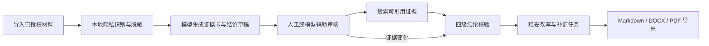

# 青迹

**面向高校社会实践的可信证据链智能体**

青迹针对社会实践中“材料很多、结论难以追溯、AI 容易写过头”的问题，把经授权的文字材料整理为可审核证据卡，再检查待写入报告的结论是否超出当前证据。系统保留来源定位、审核记录、冲突观点和补证任务，让团队知道每条结论能写到什么程度、还缺什么材料。

> 本项目为 EL 大赛 AI 智能体创新专项组参赛作品。当前仓库为 **v1.3 最终参赛版**。

> 应用内置“数字便民服务体验调研（模拟演示）”项目。人物、材料、日期与授权状态均为虚构数据，只用于展示产品流程，不代表真实调研结果。

## 核心流程



四级核验结果：

- **已有支持**：当前材料能够直接支持这句话。
- **部分支持**：材料支持较窄的表述，但不支持原句中的范围、数量、程度或因果强度。
- **暂无支持**：当前可引用材料中没有足够直接的证据。
- **存在冲突**：当前材料中出现方向相反的可引用证据。

## 主要功能

- **项目工作区**：新建、切换、重命名、归档、恢复和安全删除项目，不同项目的数据相互隔离。
- **材料导入**：支持粘贴文字，以及 `.txt`、`.md`、`.docx`、可提取文本的 `.pdf` 单份或批量导入。
- **授权与隐私边界**：记录来源角色、采集场景、日期和授权状态；手机号、身份证号、邮箱及自定义敏感词先在本地识别和脱敏。
- **证据卡生成**：模型从已授权的脱敏片段中选择有证据价值的内容，生成带原文定位的证据卡，单份长材料最多保留 40 张重点卡片。
- **证据审核**：待复核卡可以逐张编辑、确认或排除；模型辅助审核每次最多处理 8 张，避免长时间阻塞页面；所有状态变化保留审核历史。
- **结论草稿与核验**：模型从材料中提取可选结论草稿；本地检索与范围规则负责最终四级状态，模型仅辅助判断候选证据的完整语义关系。
- **动态重核**：证据被编辑、确认、排除或恢复后，系统重新核验受影响的结论，并同步更新补证任务。
- **可解释轨迹**：展示候选排序、相关分、命中依据、被排除材料、证据关系、范围提醒和最终引用。
- **可信导出**：生成成果报告版或完整审计版，支持 Markdown、DOCX 和 PDF；导出保留结论、证据、来源定位、审核状态、冲突和未解决缺口。
- **备份与恢复**：项目可导出为含版本、大小和 SHA-256 清单的 ZIP，并校验后恢复为独立项目。
- **运行与恢复**：材料已经保存但模型生成失败时，可从运行记录继续补齐证据卡或结论草稿，无需重复上传。
- **内置评测**：提供固定检索回归、隔离的模拟综合评测和项目自定义检索用例，评测记录包含数据与检索版本指纹。

## 智能体与可信边界

青迹把模型放在“生成与建议”位置，把授权、引用资格和最终核验边界保留在可审计的本地流程中：

1. 未确认授权的材料不会生成可引用证据，也不会发送给模型。
2. 模型只接收再次脱敏后的内容；模型生成的证据卡和结论草稿都保留为可复核中间产物。
3. 已确认授权且未被排除的证据可参与检索。界面与导出会区分“待复核”和“人工确认”。
4. 最终四级状态由本地确定性流程计算。模型的语义关系建议不能绕过授权、排除状态、引用编号、数量、否定方向、样本范围和强因果规则。
5. 团队分析、单名受访者陈述或材料份数不能自动证明群体性事实；“全部”“普遍”“显著”“导致”等强表述需要相匹配的证据。
6. 核验结果只说明**当前材料的支持程度**，不等于事实认证、伦理审查或法律意见。

## 快速开始

需要 Python 3.11 或更高版本。以下命令适用于 Windows PowerShell：

```powershell
git clone https://github.com/Rouin101/qingji.git
cd qingji
python -m venv .venv
.\.venv\Scripts\python.exe -m pip install -r requirements.txt
Copy-Item .env.example .env
.\scripts\run.ps1
```

浏览器通常会自动打开 `http://localhost:8501`。首次启动会在 `data\` 下创建本地 SQLite 数据库，并载入明确标注的模拟演示项目。

以干净的比赛演示数据启动：

```powershell
.\scripts\run_submission.ps1 -ResetDemo
```

`-ResetDemo` 只重建固定的 `data\submission` 目录。录屏或正式演示前运行一次；同一次演示中再次启动时省略该参数即可保留操作进度。

## 配置模型

内置模拟项目的浏览、本地检索、四级核验和导出无需云端模型。导入新材料并生成最终证据卡、结论草稿或使用模型辅助审核时，需要配置 OpenAI-compatible 模型。

复制 `.env.example` 为 `.env`，填写以下项目：

```dotenv
QINGJI_LLM_ENABLED=true
QINGJI_LLM_PROVIDER=deepseek
QINGJI_LLM_BASE_URL=https://api.deepseek.com
QINGJI_LLM_API_KEY=你的_API_Key
QINGJI_LLM_MODEL=你的模型名称
```

随后先运行不携带项目材料的连接探针，再重启应用：

```powershell
.\.venv\Scripts\python.exe scripts\test_llm_connection.py
.\scripts\run.ps1
```

API Key 只应保存在本机 `.env` 或环境变量中。仓库不会跟踪 `.env`、本地数据库、原始材料、脱敏文件或导出成果。

## 推荐演示方式

- **快速闭环**：直接使用内置模拟项目，演示“结论核验 → 加入不同观点 → 重新核验 → 可信导出”。
- **完整流程**：新建项目并上传 [`演示材料/模拟社会实践报告_校园自习空间预约体验调研.docx`](演示材料/模拟社会实践报告_校园自习空间预约体验调研.docx)，展示“导入 → 脱敏 → 证据卡 → 审核 → 结论草稿 → 四级核验”。

完整的三分钟操作顺序、讲解词与现场备用方案见 [`docs/青迹_3分钟操作脚本.md`](docs/青迹_3分钟操作脚本.md)。

## 质量验证

```powershell
.\scripts\test.ps1
```

该脚本依次运行单元与页面检查、语法检查、隔离数据库上的端到端流程、固定检索回归和模拟综合评测。测试不会修改 `data\` 下的项目库。也可以分别运行：

```powershell
python -m unittest discover -s tests -v
python scripts\e2e_apptest.py
python scripts\eval_retrieval.py
python scripts\eval_project_benchmark.py
```

模拟综合评测包含 20 份虚构材料、40 条均衡的四级结论和 50 个模拟隐私字段，检查 Verdict Macro-F1、Retrieval Recall@5、Overclaim Recall、PII Recall 和 Citation Validity。它用于可复现的开发回归，**不代表真实项目准确率或外部基准成绩**。

## 项目结构

```text
app.py                    项目概览与入口
pages/                    材料、结论、成果、运行与恢复页面
qingji/                   存储、脱敏、模型、检索、核验、备份与导出
scripts/                  启动、连接探针、测试与评测脚本
tests/                    自动化质量检查
docs/                     演示操作脚本
演示材料/                可公开复现的虚构 DOCX 示例
data/                     本地运行数据；实际内容不提交
output/                   本地导出文件；实际内容不提交
```

## 数据与使用限制

- 当前版本处理文字材料，不包含音频转写和图片 OCR。
- 当前为本地单用户应用，没有账号系统和多人权限管理。
- 本地检索使用中文字符片段、主题标题、词频降权和有限同义归一化；跨领域表达仍可能漏召回。
- 模型调用需要网络，响应质量和费用取决于用户自行配置的服务；失败运行可在应用内恢复。
- 项目 ZIP 可能包含未脱敏原文，应按敏感调研资料保管，不应上传到公开仓库。
- 导出前应由项目成员复核原文、来源定位、授权状态和最终表述。
