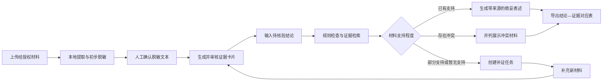
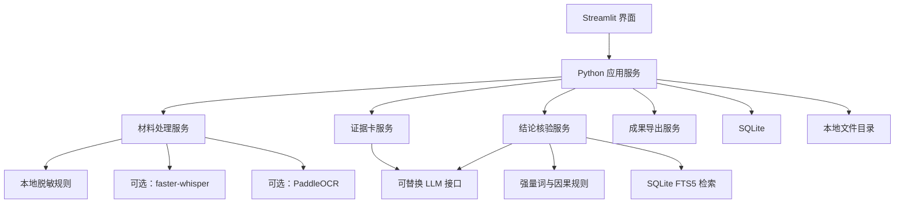

# 青迹 v0.1 单人开发方案

> 面向高校社会实践的可信证据链智能体  
> 版本：v0.1  
> 日期：2026-07-30  
> 开发方式：单人独立开发

## 1. 项目结论

### 一句话定位

**青迹是一款帮助社会实践参与者整理真实材料、检查结论依据并补齐证据缺口的可信证据链智能体。**

它不负责判断现实中的事实真伪，也不替用户编写不存在的采访，而是回答三个问题：

1. 当前材料是否支持这句话？
2. 支持或冲突的依据在哪里？
3. 如果证据不足，下一步应该补什么？

### 核心口号

**让实践有迹可循，让结论有据可查。**

### 最重要的产品边界

> 青迹只判断“当前项目材料对某项表述的支持程度”，不把材料中的单一观点当作客观事实，也不把小样本结论推广到更大群体。

---

## 2. 为什么值得做

社会实践材料通常包括访谈录音、现场照片、观察笔记、工作人员说明和团队分析。现实中的主要问题不是“完全没有材料”，而是：

- 材料分散，整理时容易丢失来源；
- 录音转成文字后，不知道原话位于哪个时间点；
- 受访者陈述、现场观察和团队推断容易混写；
- 一两名受访者的说法可能被扩大成“当地居民普遍认为”；
- 写报告时才发现某个重要结论没有材料支撑；
- 姓名、电话、精确住址等信息可能被带入公开材料；
- 通用生成式 AI 倾向于输出流畅文本，却不一定忠实于已有证据。

青迹的创新重点不是“写得更快”，而是：

> **在生成之前先核验，在证据不足时主动阻止过度表达，并把缺口转化成下一项可执行任务。**

---

## 3. MVP 核心闭环



真正体现 Agent 能力的环节：

- 维护材料、证据、结论和补证任务的状态；
- 根据结论主动选择相关证据；
- 判断下一步是生成、改写、补证还是提示冲突；
- 新材料加入后自动重新核验；
- 只允许已经审核的证据进入最终输出；
- 校验模型引用的证据编号，禁止生成不存在的来源。

---

## 4. 单人版功能范围

### P0：必须完成

#### 4.1 项目概览

- 创建一个社会实践项目；
- 展示材料数、已审核证据数、待补证结论数；
- 提供两个主入口：`上传材料`、`核验一句话`。

v0.1 不做账号系统和多人权限。

#### 4.2 文字材料导入

首个可运行版本优先支持：

- 直接粘贴文字笔记；
- 上传 `.txt` 或 `.md` 文件。

上传时填写：

- 材料类型；
- 采集日期；
- 场景说明；
- 来源角色；
- 是否已经取得记录和使用授权。

未确认授权的材料可以保存草稿，但不得进入证据检索和成果导出。

#### 4.3 本地隐私检查

第一版重点识别：

- 手机号；
- 身份证号；
- 电子邮箱；
- 用户手动标记的姓名、精确住址和其他身份信息。

处理原则：

1. 规则先在本地运行；
2. 用户确认脱敏结果；
3. 只有确认后的脱敏文本可以发送给云端模型；
4. 导出时只使用脱敏版本；
5. 原始文件与脱敏文本分开保存。

#### 4.4 证据卡片

每张证据卡至少包含：

- 证据编号；
- 标题；
- 原文或转写片段；
- 简短摘要；
- 证据类型；
- 原始文件及位置；
- 授权状态；
- 脱敏状态；
- 人工审核状态。

证据类型：

| 类型 | 含义 | 能否单独支持事实性结论 |
|---|---|---|
| 受访者陈述 | 受访者表达的经历、观点或感受 | 只能证明该受访者说过或经历过什么 |
| 工作人员说明 | 工作人员对流程或情况的说明 | 需标明身份范围和说明场景 |
| 团队现场观察 | 团队成员直接看到、记录的现象 | 可以支持具体观察，不能自动推广 |
| 文献或正式记录 | 文件、统计表或正式公开资料 | 需保留标题、日期和来源 |
| 团队分析 | 团队基于材料形成的解释 | 不能单独作为事实证据 |

AI 生成的证据卡默认状态为“待审核”，用户确认后才成为可引用证据。

#### 4.5 结论核验台

用户输入一句准备写入报告的话，系统返回四种结果：

| 状态 | 含义 |
|---|---|
| 已有支持 | 当前材料能够支持经过限定后的表述 |
| 部分支持 | 方向有依据，但范围、强度或因果表达超过材料 |
| 暂无支持 | 当前未找到直接相关材料 |
| 存在冲突 | 不同材料对同一问题给出不一致信息 |

每次核验必须返回：

- 判断结果；
- 判断理由；
- 支持、冲突和背景证据编号；
- 原始材料定位；
- 更稳妥的改写；
- 仍然缺少的证据；
- 是否建议创建补证任务。

#### 4.6 补证任务与重新核验

对于“部分支持”或“暂无支持”的结论，系统可以生成：

- 待确认问题；
- 建议补充的材料类型；
- 建议覆盖的对象或场景；
- 任务状态；
- 对应的原结论。

新增材料后，用户可以一键重新核验，并看到结论状态变化。

#### 4.7 可信导出

第一版只导出 Markdown：

- 带证据编号的稳妥表述；
- 结论—证据对应表；
- 证据目录；
- 尚未解决的材料缺口。

每条来源必须能够回到文件名和具体片段；音频功能完成后增加时间点。

### P1：核心闭环完成后再做

- 访谈录音上传与本地转写；
- 转写片段的开始、结束时间；
- 图片 OCR；
- 批量核验多个结论；
- 简单报告提纲；
- 结果导出为 PDF 或 DOCX；
- 项目时间线和统计图。

### 明确不做

- 一键生成整篇社会实践报告；
- 自动补写不存在的采访；
- 自动判断是否已经取得访谈授权；
- 实时定位、签到和安全报警；
- 人脸识别、情绪识别和身份推断；
- 复杂问卷统计；
- 多人审批与消息系统；
- 校内系统接入；
- 互联网事实核查；
- 多智能体和知识图谱；
- 医疗、法律或安全方面的专业判断；
- 对材料真实性作权威认证。

---

## 5. 页面设计

单人版控制在四个页面。

### 5.1 项目概览

- 项目名称和简介；
- 材料、证据、结论、补证任务数量；
- 待处理隐私项；
- 最近一次核验结果；
- `上传材料`和`核验一句话`按钮。

### 5.2 材料与证据

```text
输入材料
→ 填写来源与授权信息
→ 本地隐私检查
→ 人工确认脱敏
→ 生成证据卡
→ 人工审核证据类型和来源
```

证据卡支持编辑、批准、拒绝，并能查看上下文。

### 5.3 结论核验

页面从上到下展示：

1. 待核验结论输入框；
2. 强量词与因果表达提示；
3. 四级核验结果；
4. 相关证据卡；
5. 稳妥改写；
6. 创建补证任务和重新核验按钮。

### 5.4 成果与缺口

- 已核验结论；
- 补证任务及完成状态；
- 结论—证据对应表；
- 未解决缺口；
- Markdown 导出。

---

## 6. 技术方案

### 6.1 当前开发环境

本机已经确认：

- Python 3.10.20 可用；
- Git 可用；
- NVIDIA GeForce RTX 5060 Laptop GPU，显存约 8 GB；
- SQLite 3.51.2 可用，且启用了 FTS5；
- 当前未检测到 Node.js 和 npm。

因此，v0.1 采用 Python 单体方案，不先引入独立前端工程。

### 6.2 推荐技术栈

| 层级 | v0.1 选择 | 原因 |
|---|---|---|
| 界面 | Streamlit 多页面应用 | Python 内直接完成上传、表单、卡片、状态和导出 |
| 数据库 | SQLite + FTS5 | 无需部署数据库服务，足够存储单人竞赛数据并进行全文检索 |
| 数据模型 | Python dataclass / Pydantic | 校验模型结构化输出 |
| 文件存储 | 本地目录 | 演示阶段简单稳定，原件和脱敏文件分离 |
| 规则脱敏 | Python 正则 + 人工确认 | 核心敏感字段可本地处理 |
| 结论检索 | FTS5 BM25，后续可增加 Embedding | 先保证可解释与可运行 |
| LLM | 可替换的兼容接口 | 不绑定单一模型供应商 |
| 语音识别 | faster-whisper，可选 | 核心闭环稳定后再接入 |
| 图片 OCR | PaddleOCR，可选 | 放在文字和音频之后 |

Streamlit 官方支持多页面应用与跨页面 Session State；SQLite 官方 FTS5 提供全文检索；faster-whisper 支持 Python 3.9 以上并可使用 CPU 或 GPU；PaddleOCR 提供 Python OCR 接口。相关链接见文末。

### 6.3 单体架构



### 6.4 推荐目录

```text
EL/
├─ app.py
├─ pages/
│  ├─ 1_材料与证据.py
│  ├─ 2_结论核验.py
│  └─ 3_成果与缺口.py
├─ qingji/
│  ├─ db.py
│  ├─ models.py
│  ├─ settings.py
│  ├─ privacy.py
│  ├─ materials.py
│  ├─ evidence.py
│  ├─ claims.py
│  ├─ retrieval.py
│  ├─ export.py
│  └─ providers/
│     ├─ llm.py
│     ├─ asr.py
│     └─ ocr.py
├─ prompts/
│  ├─ evidence_card_v1.md
│  └─ claim_check_v1.md
├─ tests/
├─ demo_data/
├─ data/
│  ├─ raw/
│  ├─ redacted/
│  └─ qingji.db
├─ .env.example
├─ .gitignore
├─ requirements.txt
└─ README.md
```

`data/raw/`、数据库文件和 `.env` 不提交到公开代码仓库。

---

## 7. 数据模型

v0.1 保留七张核心表。

### 7.1 `projects`

| 字段 | 说明 |
|---|---|
| id | 项目编号 |
| name | 项目名称 |
| description | 项目说明 |
| created_at | 创建时间 |

### 7.2 `materials`

| 字段 | 说明 |
|---|---|
| id | 材料编号 |
| project_id | 所属项目 |
| material_type | text、audio、image |
| original_filename | 原始文件名 |
| raw_path | 原件路径 |
| sha256 | 文件摘要 |
| source_role | 来源角色 |
| context | 采集场景 |
| captured_at | 采集时间 |
| consent_status | 授权状态 |
| processing_status | 处理状态 |
| created_at | 创建时间 |

### 7.3 `segments`

| 字段 | 说明 |
|---|---|
| id | 片段编号 |
| material_id | 所属材料 |
| sequence_no | 顺序 |
| redacted_text | 已脱敏文本 |
| start_ms、end_ms | 音频时间定位，可为空 |
| locator | 笔记段落或图片位置 |
| pii_flags_json | 隐私提示 |

### 7.4 `evidence_cards`

| 字段 | 说明 |
|---|---|
| id | 证据编号 |
| project_id | 所属项目 |
| segment_id | 来源片段 |
| evidence_type | 五类证据之一 |
| title | 标题 |
| quote | 直接片段 |
| summary | 摘要 |
| review_status | draft、approved、rejected |
| created_at | 创建时间 |

### 7.5 `claims`

| 字段 | 说明 |
|---|---|
| id | 结论编号 |
| project_id | 所属项目 |
| claim_text | 原始表述 |
| verdict | 四级判断 |
| reason | 判断理由 |
| safe_rewrite | 稳妥改写 |
| missing_evidence_json | 缺口 |
| checked_at | 核验时间 |

### 7.6 `claim_evidence_links`

| 字段 | 说明 |
|---|---|
| claim_id | 结论编号 |
| evidence_card_id | 证据编号 |
| relation | support、contradict、context |
| rationale | 关联理由 |
| review_status | 用户是否确认 |

### 7.7 `followup_tasks`

| 字段 | 说明 |
|---|---|
| id | 任务编号 |
| claim_id | 对应结论 |
| title | 任务名称 |
| recommended_action | 建议行动 |
| status | open、done、cancelled |
| completion_material_id | 补充材料编号 |

模型运行记录先保存为 JSONL 文件；若时间充足，再增加 `agent_runs` 表。

---

## 8. 结论核验算法

核验不能只调用一次大模型，应采用“规则 + 检索 + 结构化判断 + 后端校验”。

### 8.1 规则层

重点识别：

- 群体化：普遍、大多数、全部、所有、均、大家都；
- 强度化：显著、极大、严重、完全；
- 因果化：导致、证明、必然引起、因此造成；
- 精确数量：比例、百分比、增长、下降；
- 绝对化：从不、一定、毫无例外。

规则命中不代表结论错误，只表示需要更强证据和更明确的适用范围。

### 8.2 检索层

1. 只检索 `approved` 且已授权的证据卡；
2. 使用 FTS5/BM25 返回最相关的 5—8 张卡片；
3. 团队分析不能作为唯一事实证据；
4. 向量检索若后续加入，只用于发现相关候选，不直接证明支持关系。

### 8.3 判断层

模型固定输出：

```json
{
  "verdict": "PARTIALLY_SUPPORTED",
  "supporting_evidence_ids": ["E001"],
  "contradicting_evidence_ids": [],
  "context_evidence_ids": [],
  "reason": "当前仅有一名受访者表达该观点，不能支持群体性表述。",
  "missing_evidence": [
    "补充不同背景参与者的访谈材料",
    "明确样本数量与选择范围"
  ],
  "safe_rewrite": "一名受访者表示，使用线上办事平台时曾遇到困难。"
}
```

### 8.4 后端校验

- `verdict` 必须属于四种允许状态；
- 所有证据编号必须来自本次检索结果；
- 不得引用草稿、拒绝、未授权材料；
- 命中群体化表达且只有单一样本时，不允许返回“已有支持”；
- 因果表达没有专门设计或正式资料时，默认提示降低为关联或观察表述；
- 输出内容不得出现脱敏前信息。

---

## 9. 演示数据与答辩故事

### 9.1 演示数据

全部使用本人或志愿者明确同意录制的模拟材料：

- 材料 A：一名受访者表示线上办事遇到困难；
- 材料 B：工作人员介绍现场仍保留人工协助；
- 材料 C：团队观察到一名年长访客寻求帮助；
- 材料 D：后续补充的两名受访者观点，其中至少一人持不同意见。

演示材料中使用虚构姓名和号码，并明确标注为模拟数据。

### 9.2 三分钟演示脚本

| 时间 | 展示内容 |
|---|---|
| 0:00—0:20 | 介绍痛点：传统 AI 会把一句话写得很漂亮，但不知道依据在哪里 |
| 0:20—0:45 | 展示已授权材料和自动脱敏结果 |
| 0:45—1:10 | 打开证据卡，回溯到原始笔记或录音时间点 |
| 1:10—1:40 | 输入“当地居民普遍认为线上办事平台使用困难” |
| 1:40—2:00 | 青迹判定“部分支持”，指出单一样本不能支持“普遍” |
| 2:00—2:20 | 一键创建补证任务，并加入新的授权材料 |
| 2:20—2:40 | 重新核验，展示冲突或范围变化 |
| 2:40—3:00 | 导出“本次访谈的三名参与者中……”及证据对应表 |

演示重点不是把结论强行变成“支持”，而是让最终表述准确反映样本范围。

### 9.3 演示兜底

- 准备一套已经处理完成的本地数据；
- 不在现场首次下载模型；
- ASR 失败时允许导入预生成且保留时间点的转写稿；
- LLM 接口失败时提供固定的离线演示响应，但必须明确为备用模式；
- 连续完整演练至少 5 次；
- 准备录屏视频，现场仍优先运行真实系统。

---

## 10. 评测方案

### 10.1 小型测试集

单人可完成的最低测试集：

- 20 份经授权的模拟材料；
- 40 个待核验结论；
- 四种 verdict 各 10 个；
- 至少 20 个过度概括或因果表达案例；
- 至少 50 个手机号、邮箱、身份证号等隐私字段；
- 至少 10 个证据冲突案例。

为每个测试案例手工标注：

- 预期核验状态；
- 应引用的证据；
- 不应引用的证据；
- 是否需要保守改写；
- 应创建的补证方向。

### 10.2 核心指标

| 指标 | 含义 | v0.1 内部目标 |
|---|---|---|
| Citation Validity | 引用编号真实存在且来自本次候选集 | 100% |
| Retrieval Recall@5 | 正确证据是否进入前 5 个候选 | 不低于 90% |
| Verdict Macro-F1 | 四级核验判断的一致性 | 不低于 0.80 |
| Overclaim Recall | 过度概括案例被识别的比例 | 不低于 90% |
| PII Recall | 规则覆盖的敏感字段被发现的比例 | 不低于 95% |
| Traceability | 导出结论能否回到具体来源 | 100% |
| Stability | 完整演示连续成功次数 | 5 次 |

这些是开发验收目标，不应在未完成测试前写成已经达到的结果。

### 10.3 用户试用

找 3—5 名有社会实践或调研经历的同学，完成：

1. 导入一组材料；
2. 审核证据卡；
3. 核验一项结论；
4. 创建并完成一个补证任务；
5. 导出结果。

记录：

- 完成时间；
- 出错位置；
- 是否能理解四级判断；
- 是否信任证据定位；
- 哪一步最需要人工修改。

---

## 11. 单人 14 天排期

原则：先完成文字版闭环，再增加多模态。

| 天数 | 唯一主任务 | 当日完成标准 |
|---|---|---|
| Day 1 | 建立项目骨架和 SQLite 表 | 应用能启动，数据库能初始化 |
| Day 2 | 文字材料上传、授权和 SHA-256 | 能保存一条材料并回看原文 |
| Day 3 | 本地隐私规则与人工确认 | 导出文本不含测试手机号、邮箱、身份证号 |
| Day 4 | 文本切片和证据卡生成 | 一条材料能生成可编辑的证据卡 |
| Day 5 | 证据卡审核和来源定位 | 只能检索 approved 证据 |
| Day 6 | FTS5 检索 | 输入关键词能返回相关证据卡 |
| Day 7 | 强量词、因果表达规则 | 能标记“普遍、显著、导致”等风险 |
| Day 8 | 结构化结论核验 | 返回四级 verdict、理由和证据编号 |
| Day 9 | 后端引用校验和稳妥改写 | 不存在的证据编号会被拒绝 |
| Day 10 | 补证任务和重新核验 | 新材料加入后能更新原结论 |
| Day 11 | Markdown 可信导出 | 每个结论都带可回溯来源 |
| Day 12 | 接入录音转写；不稳定则完善文字版 | ASR 可用或已有明确备用方案 |
| Day 13 | 测试集、指标统计和界面整理 | 自动输出评测结果 |
| Day 14 | 五次演练、录屏和答辩材料 | 主流程连续五次无故障 |

### 砍功能顺序

如果进度落后，按以下顺序删除：

1. 图片 OCR；
2. 音频上传，只保留带时间点的转写文本；
3. 图表和项目看板；
4. 报告提纲；
5. 多项目支持。

不能删除：

- 授权状态；
- 脱敏确认；
- 证据卡人工审核；
- 四级结论核验；
- 引用编号校验；
- 补证任务；
- 带来源导出。

---

## 12. 当前第一项开发任务

在开始接模型前，先完成一个完全不依赖 AI 的纵向切片：

```text
创建项目
→ 粘贴一段文字材料
→ 确认授权
→ 本地脱敏
→ 人工创建一张证据卡
→ 输入一句结论
→ 手工关联证据
→ 导出带来源段落
```

这一纵向切片完成后，再依次用模型替换“证据卡生成”和“结论核验”两个环节。这样可以把产品逻辑与模型不稳定性分开调试。

Day 1 的代码目标：

- 创建目录骨架；
- 初始化 Git；
- 建立 Python 虚拟环境；
- 添加 `.gitignore` 和 `.env.example`；
- 创建 SQLite 初始化脚本；
- 创建 `projects`、`materials`、`segments`、`evidence_cards`、`claims`、`claim_evidence_links`、`followup_tasks` 七张表；
- 启动一个包含“项目概览”的 Streamlit 页面。

---

## 13. 技术资料

- [Streamlit 多页面应用](https://docs.streamlit.io/develop/concepts/multipage-apps)
- [Streamlit Session State](https://docs.streamlit.io/develop/api-reference/caching-and-state/st.session_state)
- [SQLite FTS5](https://www.sqlite.org/fts5.html)
- [faster-whisper 官方仓库](https://github.com/SYSTRAN/faster-whisper)
- [PaddleOCR Python 快速开始](https://www.paddleocr.ai/v3.0.0/en/quick_start.html)

---

## 14. 资格风险

赛事原文要求使用火山引擎・扣子作为智能体开发工具。当前方案完全按照自研代码设计，但在继续投入前，仍应向赛事方书面确认：

> “核心系统、前后端和模型编排全部由参赛者自研，不使用扣子，是否仍符合 AI 智能体创新专项组的参评要求？”

在取得明确答复前，该问题应记录为参赛资格风险，而不是技术问题。
